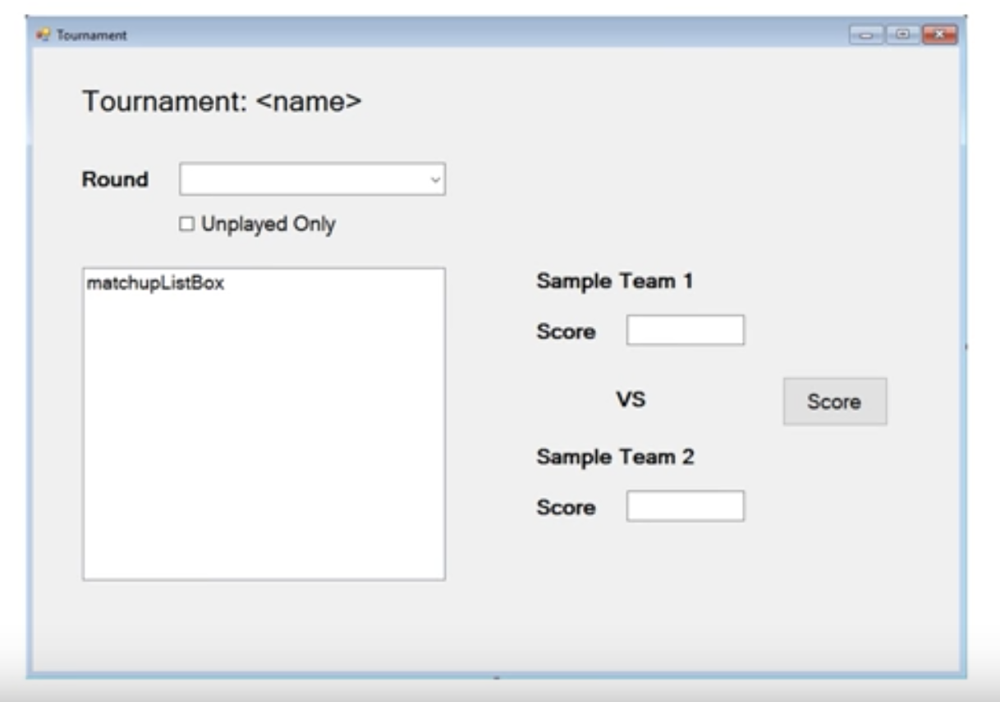
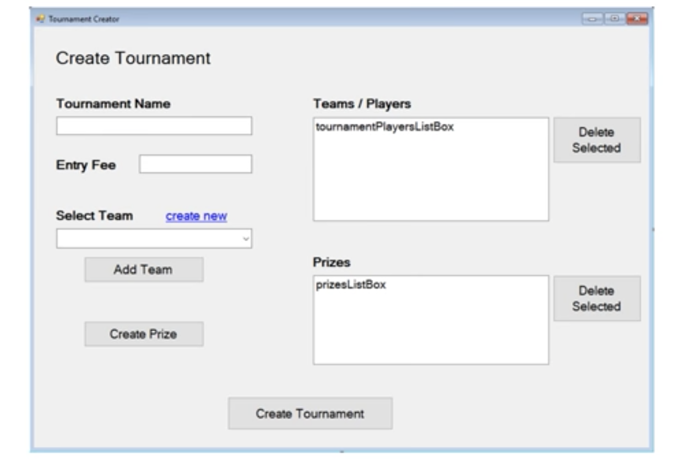
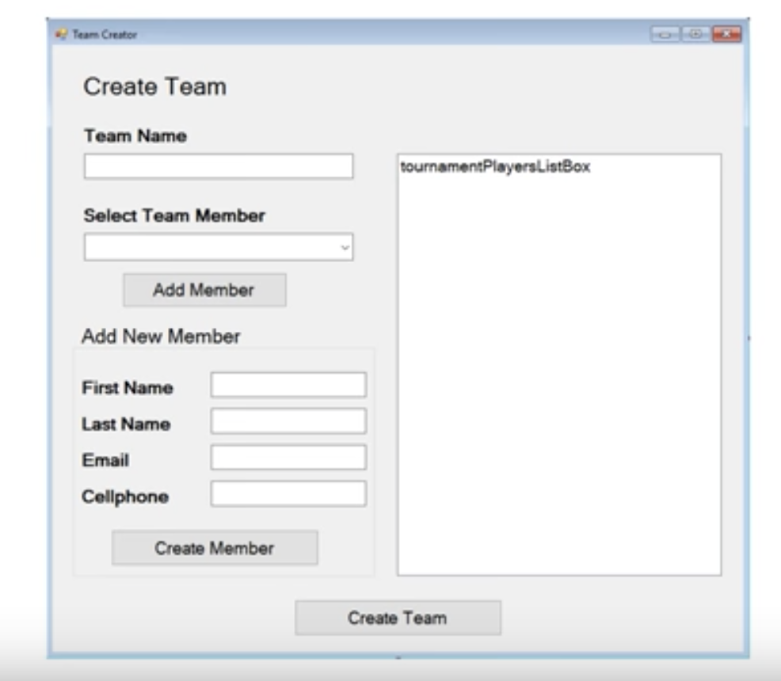
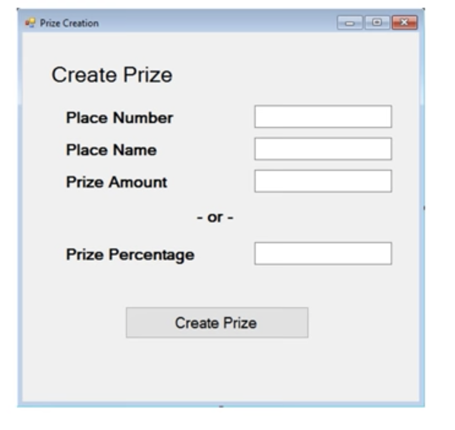
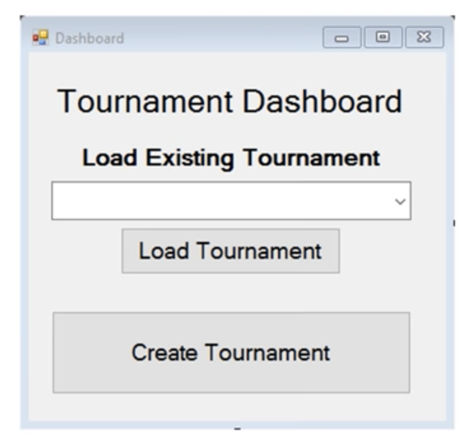

# Full C# Tournament Application.   
  

/cdn.vox-cdn.com/uploads/chorus_asset/file/11519241/bracket_board.jpg)  
  
## NAVIGATION 
- [Summary](#Summary)
- [Initial Planning](#Initial-Planning)
- [Data Design](#Data-Design)
- [User Interface Design ](#User-Interface-Design)
- [LOGIC PLANNING](#LOGIC-PLANNING)
    
  

## Summary 
  
A tournament Tracker that sets up a schedule for teams to play each other in a single-elimination style matchups.   
Someone wants you to set up a tournament, to tell you will play who and set it up.  
  
Can be used for setting your own tournaments up such as in gaming, pingpong etc.   
Multi-form Winform application.  
SQL Database. 
Text file storage.  
Dapper.  
Linq.  
Interfaces.   
Emailing C#  
Custom Events.  
Advanced Debugging.  
  
## Initial Planning
  
It's extremely important in coding, in my experience before with COBOL development and others to flesh out the details high level design etc before getting stuck in to the app.   

**REQUIREMENTS** 
  
1. Tracks games and their outcome.  
2. Multiple competitors play.  
3. Creates a tournament plan, who plays who in what order.   
4. Schedules games.  
5. A single loss eliminates a player.  
6. The last player wins.  
  
### ASK QUESTIONS  
  
1. How many players will it handle? Is this a variable?  
2. how do we handle if the tournament doesn't have the full amount of players, can we back down to 24, 16, 8 etc.  
3. Should the ordering of who plays how be random or ordered.  
4. Should we schedule the game?   
5. If scheduled, how do we know when and how to schedule.  
6. Does system need to hold score.  
7. Where to store data?   
8. What should the front end look like?  
9. Will it handle payouts etc? 
10. What type of reporting is required?   
11. Who can fill in results? (auth)
12. Should system contact users prior to events.     

### HIGH LEVEL BIG PICTURE DESIGN  
  
**CODE** WONT be behind forms in front end.  
`STRUCTURE` Windows form   
`DATA` SQL &/OR text file.    
`USERS` One at a time on one application.    

**Key Concepts**   
  
- Email  
- SQL  
- Custom Events (how do we know to check for more games etc?)  
- Error handling.  
- Interfaces.  
- Random ordering.   
- Texting as bonus feature.  
  
## Data Design
  
 This process gets us thinking about classes which this will be.     
 THis means that when we get to actually adding the class libraries we are more focusing on is this the right name, am i missing anything rather than is this the right data.  
 Best to do architecture design on paper or draw.io etc.    
  
**Team**   
  
- Team Members `List<person>`
- Team Name `string`  
  

**Person**  
  
- First name `string`  
- Last Name `string`    
- Email address `string`  
- Mobile number  `string`  *this isn't a number to be manipulated, so string is safer*   
   
*Break apart name early, for better use later such as in email and sorting big issues with double barrel names etc*  
   
   
**Tournament**   
  
- TournamentName `string`  
- EntryFee `decimal` *needs precision*  
- EnteredTeams `List<Team>`    
- Prizes  ` List<Prize>`   
- Rounds `List<List<Matchup>>`  
  
**Prize**  
  
- PlaceNumber `int`  
- PlaceName  `string`  *i.e. champion, runner up etc*  
- PrizeAmout `decimal`  
- PrizePercentage  `double`   
  
**Matchup**  
  
- Entries `List<MatchupEentry>`  
- Winner `Team object`  
- MatchupRound `int`  
  
**MatchupEntry**  
  
- TeamCompeting  `Team object`  
- Score `double`  
- ParentMatchup `Matchup object`    
  
## User Interface Design
    
 Best to do architecture design on paper or draw.io etc.    
 **Where** do i start? : Start anywhere, or where you know and build out.    

**TOURNAMENT VIEWER**  
    
Using Windows Forms.   

  
  
 - Round is a dropdown.  
 - Score button to add. 
   

**Tournament Creator** 
  
   
  
- Add team button needs it's own form.  
- Add prize button needs it's own form.  
  
**Remaining Forms**    

 
  

  



## LOGIC PLANNING
  
**Create Tournament form**  
Click create new team button  
which takes us to new team form (open it)  
once the new team is created it needs to close out the form  
Go back to original create tournament form and also include the new team we just added.  
  
More to add ... 


## Class Library Creation  
  
This will be created using .NET framwork library class.   
- Make sure you delete class1 
- Ensure the naming convention is good. I.e. Should have affix library .  
- Since we planned this out already should be easier.  
  
1. Add new class 
2. Call it team model.. **Ensure we have the name Model**  because it is a data model that captures data.  
  
    

**TYPE** prop to get auto property generator in a class.   
   
Sample code  

```
    public class TeamModel
    {
        public List<PersonModel> TeamMembers { get; set; } = new List<PersonModel>();
        public string TeamName { get; set; }

    }
```
  

## FORMS AND UI  

**NEED** to set this up as starter project (right click)
**NEED** to set your startup form in `Program.cs` like below.  
  
```
        static void Main()
        {
            Application.EnableVisualStyles();
            Application.SetCompatibleTextRenderingDefault(false);
            Application.Run(new TournamentDashboardForm()); // this wont exit until the form closes (so if other forms close, it doesn't matter app still runs.)
        }
```

Use the designs from earlier.     
- Add new project 
- Windows Form Application.  
- Call it Tracker UI.  
- Right click on form1 rename `TournamentViewerForm`
- Change font straight away, if you do it later it won't reflect from earlier ones.  
- Don't copy paste forms, it's a headache because of refs.  But you can copy paste labels.  


## SQL DESIGN   
  


## FINAL NOTES TO REMEMBER   

- XML comments make for good documentation within the code and dynamically load for methods.  